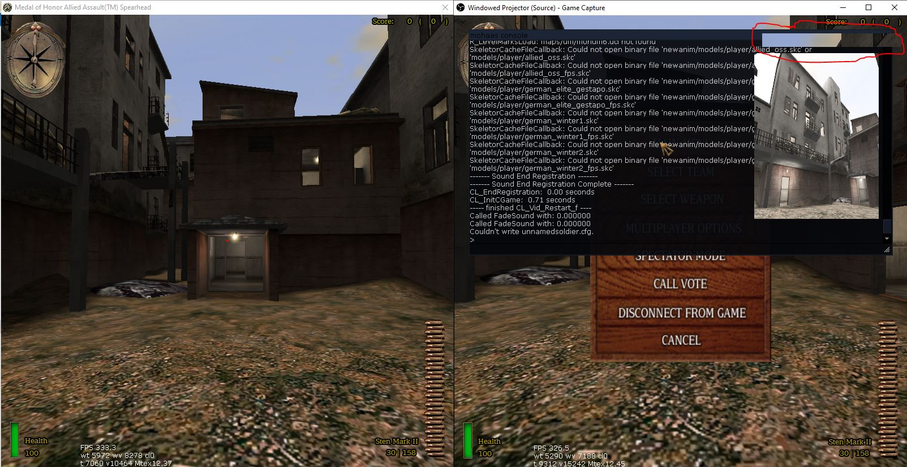

# moh-obs-fix
CLI helper to change the 'renderer present method' useful for fixing MOHAA's OBS issues \
(when trying to use the 'GameCapture' source option).


> [!WARNING]
> Only usable with NVIDIA graphics cards at the moment.

---

## The initial issue with Game Capture


- Left: MOHAA(:SH) window
- Right: OBS GameCapture

Whilst trying to capture MOHAA (/-SH/-BT) using the GameCapture feature of [OBS (Open Broadcaster Software)](https://obsproject.com), you will encounter the issue fairly quick. The captured screen is only really updated by ingame menus like the console or scoreboard, which I wanted to fix :). 

---

## Fast & Simple Usage
- Download the [latest release](https://github.com/slowptr/moh-obs-fix/releases/tag/v1.0)
- Execute 'moh-obs-fix.exe' (as Administrator)
- Input 1 for fixing the OBS-Issues
  - (If you want to revert it to default, input 2)
- (Re-)start MOHAA and try capturing the game using the OBS-GameCapture feature

---

## Optional: Build Steps
- Take a look at the [xmake project page](https://github.com/xmake-io/xmake)
  - Download & Install it using their provided instructions
  - Make sure the 'xmake.exe' is included in your PATH variable
- Clone / download the contents of this repository
- Open a cmd / powershell shell inside the cloned repo
  - execute ```xmake``` to compile (output will be inside the newly created build directory)
  - execute ```xmake r``` to run the executable or run the compiled .exe

---

## Troubleshooting
- Contact me using the issues page of this project! :]